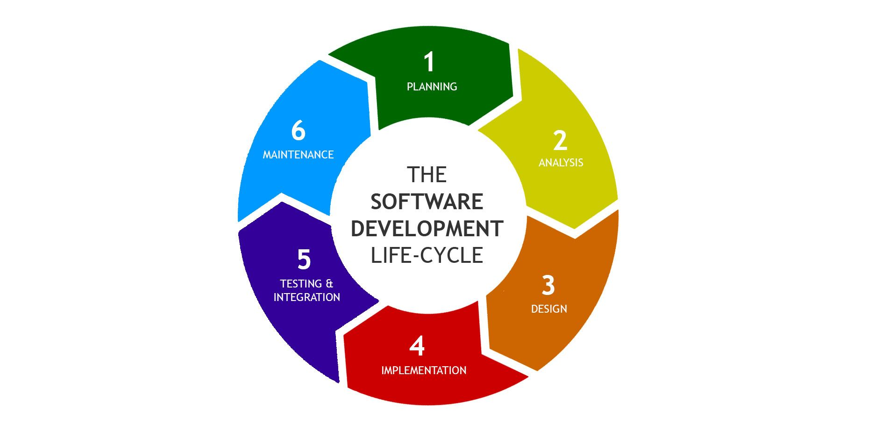

# What does integration means ?

## Software development life-cycle (SDLC)



## Integration testing

Integration testing (sometimes called integration and testing, abbreviated I&T) 
is the phase in software testing in which individual software modules 
are combined and tested as a group. 

#### Examples for I&T in AltScale projects
```
Backend + FrontEnd + Selenium
```
```
Backend + FrontEnd + Cucmber
```

Integration testing is conducted to evaluate the compliance of a system 
or component with specified functional requirements. 
It occurs after unit testing and before validation testing. 

```
Django Unit Tests
```
```
Python (PEP 8) linting with pylint
```
```
TODO 
Validation, after proper CD workflow is accepted
```

Integration testing takes as its input modules that have been unit tested, 
groups them in larger aggregates, 
applies tests defined in an integration test plan to those aggregates, 
and delivers as its output the integrated system ready for system testing.

```
TODO
System Testing, after proper CD workflow is accepted
```

# What is Continuous integration (CI)

## Development and Testing Workflow

* #### Run tests locally
CI is intended to be used in combination with automated unit tests 
written through the practices of test-driven development. 
This is done by running and passing all unit tests 
in the developer's local environment before committing to the mainline. 
This helps avoid one developer's work-in-progress breaking another developer's copy. 
Where necessary, partially complete features can be disabled before committing, 
using feature toggles for instance.

* #### Compile code in CI
A build server compiles the code periodically or even after every commit 
and reports the results to the developers. 
The use of build servers had been introduced outside the XP (extreme programming) 
community and many organisations have adopted CI without adopting all of XP.

* #### Run tests in CI
In addition to automated unit tests, organisations using CI typically use 
a build server to implement continuous processes of applying 
quality control in general — small pieces of effort, applied frequently. 
In addition to running the unit and integration tests, 
such processes run additional static analyses, 
measure and profile performance, 
extract and format documentation from the source code 
and facilitate manual QA processes. 
On the popular Travis CI service for open-source, 
only 58.64% of CI jobs execute tests.
This continuous application of quality control aims 
to improve the quality of software, 
and to reduce the time taken to deliver it, 
by replacing the traditional practice of applying quality control after completing all development. 
This is very similar to the original idea of integrating more frequently 
to make integration easier, only applied to QA processes.

* #### Deploy an artifact from CI
Now, CI is often intertwined with continuous delivery in a so called CI/CD pipeline. 
CI makes sure the software checked in on the mainline is always in a state 
that can be deployed to users and CD makes the deployment process fully automated.

# CI/CD Best Practices
* Maintain a code repository
* Automate the build
* Make the build self-testing
* Everyone commits to the baseline every day
* Every commit (to baseline) should be built
* Every bug-fix commit should come with a test case
* Keep the build fast
* Test in a clone of the production environment
* Make it easy to get the latest deliverable/s
* Everyone can see the results of the latest build
* Automate deployment
